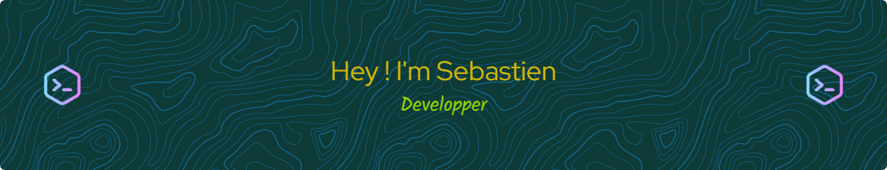

 

### Hi there 👋

- 🌱 I’m currently learning NextJS & TailwindCSS
- 👯 I’m looking to collaborate on **high value projects**
- 🌐 Go check my new website : [seawebstudio.com]  !
- 🎨 Go check my portfolio on : https://portfolio.seawebstudio.com
- 💬 Ask me about music, tech or philosophy !
- 📫 How to reach me: contact@seawebstudio.com

<!--
**beseb/beseb** is a ✨ _special_ ✨ repository because its `README.md` (this file) appears on your GitHub profile.

Here are some ideas to get you started:

- 🔭 I’m currently working on ...
- 🌱 I’m currently learning ...
- 👯 I’m looking to collaborate on ...
- 🤔 I’m looking for help with ...
- 💬 Ask me about ...
- 📫 How to reach me: ...
- 😄 Pronouns: ...
- ⚡ Fun fact: ...
-->
